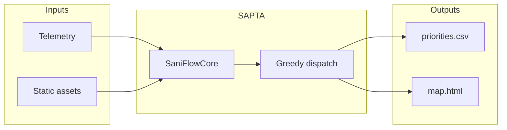
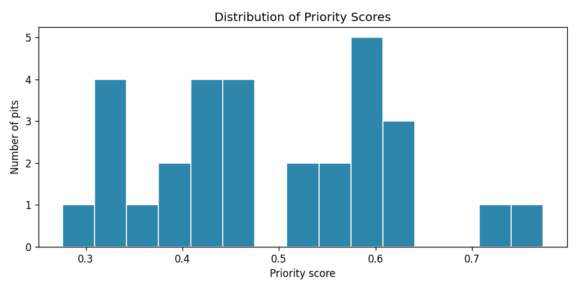

# SAPTA

**Climate-resilient sanitation priority and vacuum-truck dispatch for rural pit latrines.**

[](https://www.python.org/downloads/)
[](LICENSE)
[](https://github.com/yorliabdulai/sapta_ml/actions/workflows/ci.yml)

SAPTA helps field teams decide **which pit latrines to service first** when rainfall, soil conditions, and limited truck capacity create groundwater contamination risk. The scoring engine (SaniFlow brain layer) produces a 0–1 priority index; a greedy dispatcher assigns vacuum-truck routes under time and capacity constraints.

---

## Quick Start (under 2 minutes)

```bash
git clone https://github.com/yorliabdulai/sapta_ml.git
cd sapta_ml
pip install -r requirements.txt
pip install -e .
```

**Run the pipeline**

| Platform | Command |
|----------|---------|
| **Windows** (recommended) | `py scripts/run_pipeline.py` |
| macOS / Linux | `python3 scripts/run_pipeline.py` |
| Any (venv active) | `python scripts/run_pipeline.py` |

On Windows, if `python` prints *"Python was not found"* (Microsoft Store alias), use **`py`** instead — the same interpreter that runs `pip`.

Optional venv:

```bash
py -m venv .venv
.venv\Scripts\activate          # Windows
pip install -r requirements.txt && pip install -e .
py scripts/run_pipeline.py
```

**Outputs:**

- `outputs/priorities.csv` — scored pits with `DISPATCHED` / `WAITING`
- `outputs/map.html` — interactive Folium map (open in a browser)
- `assets/sample_priority_hist.png` — score distribution chart

---

## Problem

In many rural communities (e.g. Northern Ghana), **pit latrines** near wells can leak nutrients and pathogens into groundwater, especially after heavy rain. Vacuum trucks cannot service every pit in one trip—teams need a **transparent, repeatable** way to rank risk and plan dispatch.

## Why it matters

- **WASH / public health:** Prioritize pits that threaten drinking water.
- **Climate:** Seasonal rainfall (CHIRPS-style forecasts) increases short-term risk.
- **Operations:** Fixed truck hours and pit service time make prioritization a real constraint.

## Solution

1. Ingest pit **telemetry** (fill, rainfall forecast) and **static** data (depth, distance to well, soil, structure).
2. Compute a **calibrated heuristic priority index** (0–1) via `SaniFlowCore`.
3. Run **greedy dispatch** under truck capacity and hour limits.
4. Export **CSV + map** for supervisors and field crews.



## Model approach

**v0.1 is not a trained ML model.** It is a **weighted heuristic risk index** with domain-calibrated weights (fill, rain, distance decay, leach, vadose, condition). This is intentional for hackathon clarity and auditability.

| Factor | Role |
|--------|------|
| Fill level | Normalized fill / pit depth |
| Rainfall | Capped at 50 mm forecast |
| Distance to well | Exponential decay (λ = 30 m) |
| Soil leach, vadose, condition | Ordinal scales normalized to [0, 1] |

Future work: learn weights from labeled overflow events (see [models/README.md](models/README.md)).

## Dataset

Demo data is **synthetic** (30 pits, reproducible seed). See [data/README.md](data/README.md) for the full schema and how to plug in real CSVs.

## Setup

- Python **3.10+**
- Dependencies: `pip install -r requirements.txt`
- Editable install (tests/imports): `pip install -e .`
- Dev tools: `pip install -e ".[dev]"`

Configuration: [configs/default.yaml](configs/default.yaml)

## Run

| Task | Command |
|------|---------|
| Full pipeline | `py scripts/run_pipeline.py` (Windows) or `python3 scripts/run_pipeline.py` |
| Custom seed / pits | `py scripts/run_pipeline.py --seed 0 --n-pits 50` |
| Tests | `py -m pytest -q` |
| Demo notebook | `py -m jupyter notebook notebooks/01_sapta_demo.ipynb` |

## Demo

1. Run the pipeline (above).
2. Open `outputs/map.html` — red/orange/green markers by risk; truck icon = dispatched.
3. See sample chart: 

Optional: add `assets/demo.gif` (see [assets/README.md](assets/README.md)).

## Sample outputs

After `run_pipeline.py`:

```
SAPTA pipeline complete.
  Pits: 30 | Dispatched: 10 | Waiting: 20
  CSV:  outputs/priorities.csv
  Map:  outputs/map.html
```

## Evaluation

- **Scoring:** All priorities in [0, 1]; deterministic for fixed seed (see `tests/test_scoring.py`).
- **Dispatch:** Respects `truck_capacity` (default 10) and `hours_limit` (default 48 h, 2 h/pit).
- **Coverage:** Report % dispatched and mean priority of dispatched vs waiting pits from CSV.

## Limitations

- Synthetic data only in the default pipeline
- No vehicle routing (VRP)—greedy ordering by score only
- No live CHIRPS API integration yet
- No trained ML model in v0.1

## Future improvements

- Real pit CSV ingest and CHIRPS rainfall API
- Learned model weights (e.g. XGBoost) with validation on historical events
- Streamlit/Gradio hosted demo
- Mobile-friendly API for field apps

## Hackathon alignment

**Social impact / climate health / WASH:** SAPTA targets equitable sanitation operations under climate stress—helping teams protect groundwater when resources are scarce.

## Project structure

```
sapta_ml/
├── src/sapta/          # Core library
├── scripts/            # CLI pipeline
├── notebooks/          # Narrative demo
├── configs/            # Weights and limits
├── tests/              # pytest
├── outputs/            # Generated artifacts (gitignored)
└── assets/             # README images
```

## Contributors

- Abdulai Yorli ([@yorliabdulai](https://github.com/yorliabdulai))

## License

[MIT](LICENSE)
